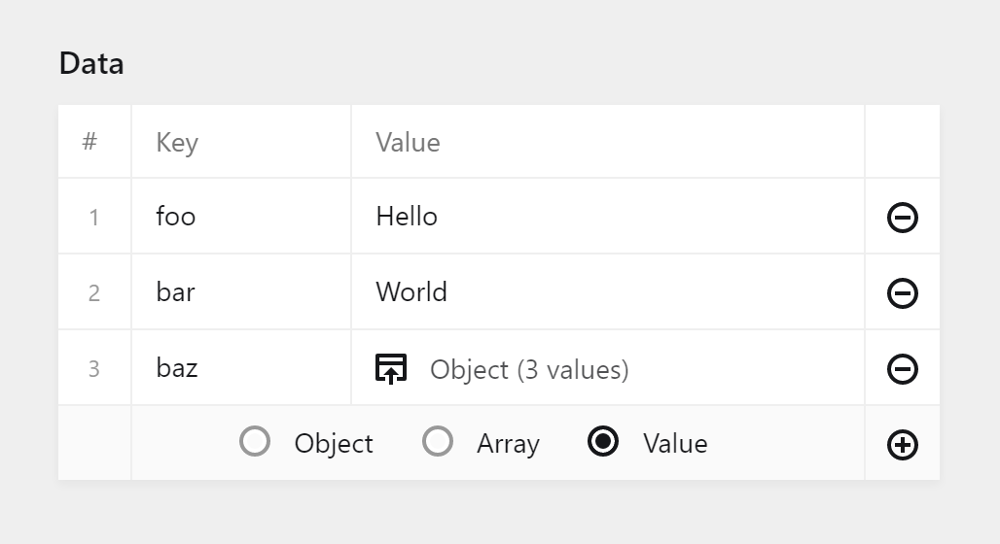

# kirby-json

Kirby JSON field and JSON editor Vue component.

## Installation

With [Composer](https://packagist.org/packages/oblik/kirby-json):

```
composer require oblik/kirby-json
```

## Usage

### Field

In the blueprint:

```yml
fields:
  myData:
    type: json
```

Available blueprint options for the editor:

```yml
array: false  # Saved value should be an array?
keys: false   # Edit object keys?
values: true  # Edit values?
mutate: false # Add/remove entries?
sort: true    # Allow entry reordering?
```

In the template, use the native Kirby `toData()` method:

```php
$data = $page->myData()->toData('json');
```

### Component

If you're building a plugin and you need to allow the user to edit JSON, you can use the same component that the above JSON field uses, `k-json-editor`, in your own panel plugin:

```html
<template>
  <k-json-editor
    v-model="data"
    :label="label"
    :options="options"
    @input="input"
  ></k-json-editor>
</template>
```

The `options` you can pass to the component:

```json
{
  "isKeysEditable": true,
  "isValuesEditable": true,
  "isMutatable": true,
  "isSortable": true
}
```


